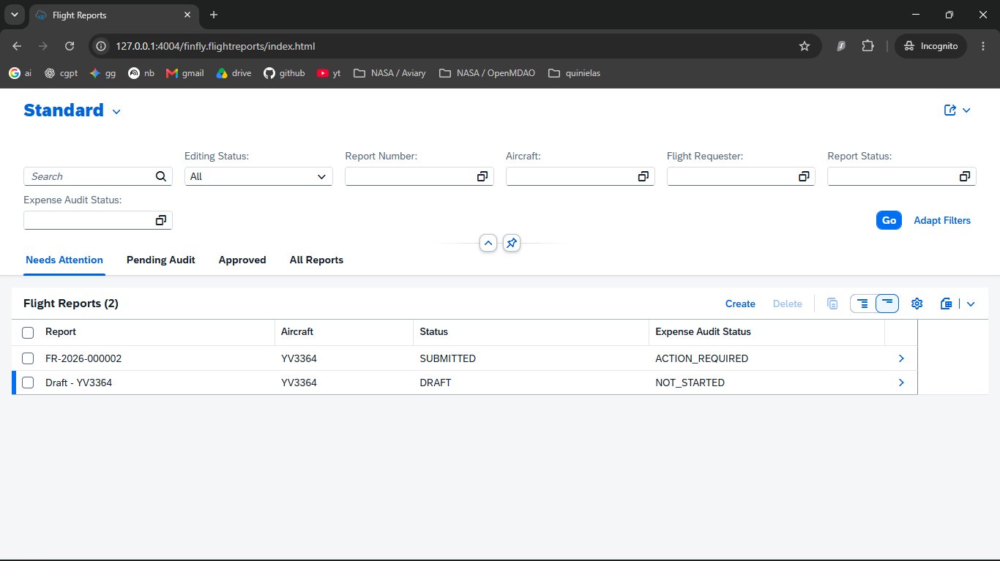
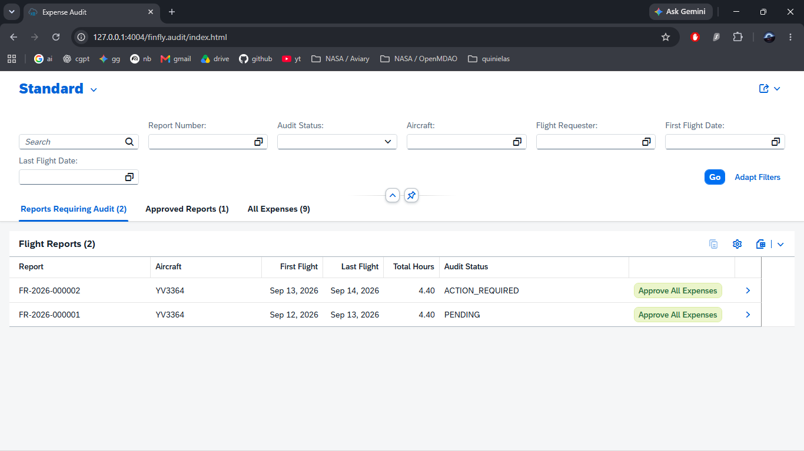
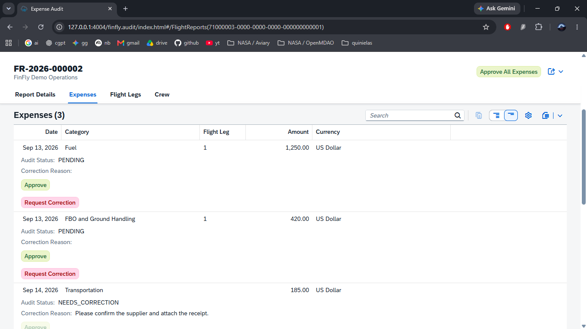
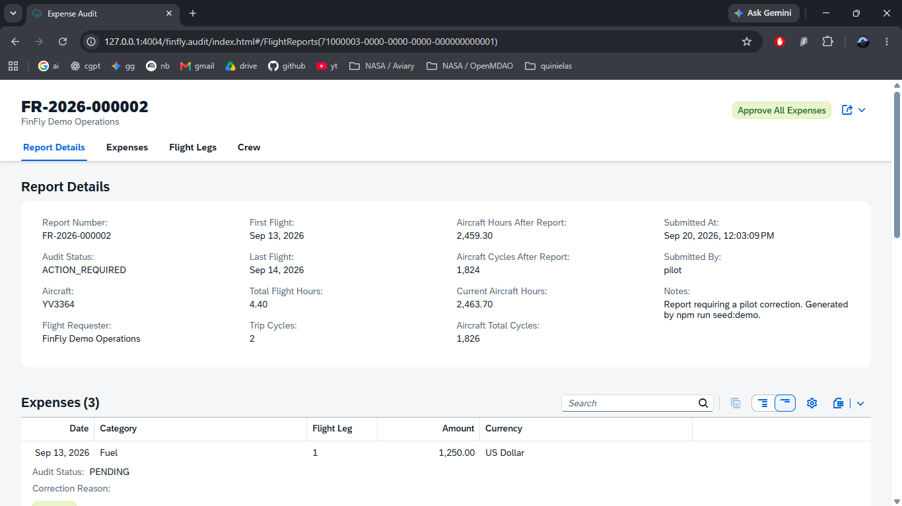
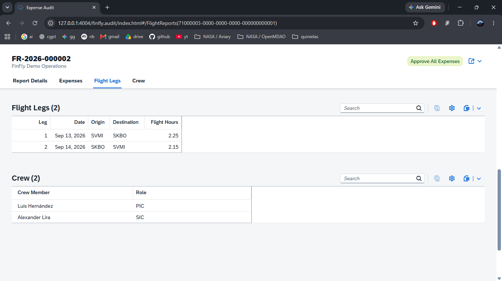
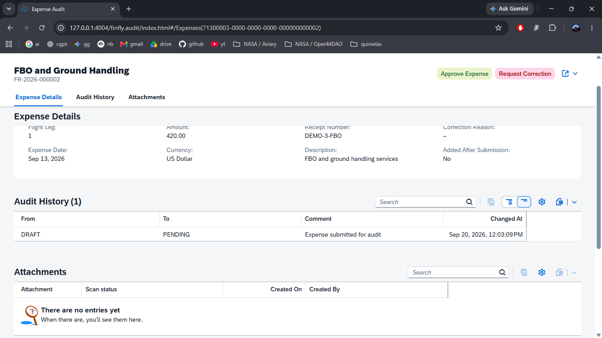

# FinFly

FinFly is a portfolio MVP for managing corporate flight reports and their related expenses. It demonstrates how an approval-driven business process can be modeled with the SAP Cloud Application Programming Model (CAP) and delivered through role-specific SAP Fiori elements applications.

Flight crews use FinFly to record trips, crew assignments, expenses, and receipts. Auditors use a separate review application to approve expenses or return them to the pilot for correction, with every workflow transition preserved in an audit history.



## Business purpose

Corporate flight operations often collect operational details and trip expenses across spreadsheets, email, and receipt attachments. This makes approvals difficult to track and creates uncertainty about which expenses still require attention.

FinFly brings that process into one system:

1. A pilot creates a flight report and records its legs, crew, and expenses.
2. FinFly validates the report, calculates flight summaries and currency amounts, and assigns an official report number on submission.
3. An auditor reviews each expense and either approves it or requests a correction.
4. The pilot corrects and resubmits returned expenses until the report is fully approved.

The project is intentionally scoped as an MVP, but its domain and workflow are modeled as a realistic business application rather than a basic CRUD example.

## What the project demonstrates

- Domain modeling with CDS associations, compositions, calculated fields, constraints, and reusable types
- OData services implemented with SAP CAP, Node.js, and TypeScript
- SAP Fiori elements applications driven by CDS annotations
- Draft-enabled report editing
- Bound actions for report submission, approval, correction, resubmission, and exchange-rate refresh
- Role-based authorization for pilots, auditors, and administrators
- Organization-level data isolation for multi-tenant-style access control
- Transactional report-number assignment and workflow updates
- Expense attachments using `@cap-js/attachments`
- Multi-currency expenses with a mocked external exchange-rate service
- Optimistic concurrency through OData ETags
- Persisted report summaries and workflow audit history
- Integration and service-level testing with Vitest and `@cap-js/cds-test`

## Applications

### Pilot application

The pilot application supports creating flight reports, maintaining flight legs and crew assignments, recording expenses, submitting reports, and correcting expenses returned by an auditor. Reports are separated into work queues so pilots can quickly identify drafts and reports requiring attention.

The overview above shows the pilot's role-specific work queues for reports that need attention, are pending audit, or have been approved.

### Audit application

The audit application presents submitted reports and their expenses to authorized reviewers. Auditors can approve individual expenses, approve all eligible expenses, or request a correction with a reason. The report remains actionable until all returned expenses have been resubmitted.





<details>
<summary>More workflow screenshots</summary>

### Report details and calculated operational totals



### Flight legs and assigned crew



### Expense history and attachments



</details>

## Architecture

```text
SAP Fiori elements
  |-- Pilot application
  `-- Audit application
           |
           v
SAP CAP OData services
  |-- ExpenseService
  `-- AuditService
           |
           v
CDS domain model + SQLite (local development)
           |
           `-- Mocked exchange-rate service
```

The repository follows the standard CAP structure:

```text
app/      Fiori elements applications and UI annotations
db/       CDS domain model and local seed data
srv/      Service definitions, TypeScript handlers, and external-service model
test/     Integration, authorization, validation, and workflow tests
scripts/  Reusable demo-data seeder
```

## Technology stack

| Area | Technology |
| --- | --- |
| Application framework | SAP Cloud Application Programming Model (CAP) |
| Backend | Node.js, TypeScript, OData |
| Frontend | SAP Fiori elements, SAPUI5 |
| Data model | Core Data Services (CDS) |
| Local database | SQLite |
| Attachments | `@cap-js/attachments` |
| Testing | Vitest, `@cap-js/cds-test` |

## Run locally

### Prerequisites

- A currently supported Node.js LTS release
- npm

Install the dependencies and start the CAP server:

```bash
npm install
npm start
```

The server is available at `http://localhost:4004` by default. Open either application directly:

- Pilot application: `http://localhost:4004/finfly.flightreports/index.html`
- Audit application: `http://localhost:4004/finfly.audit/index.html`

### Mock users

Local development uses CAP's mocked authentication. These credentials are demo-only and must not be used for a production deployment.

| User | Password | Roles | Organization |
| --- | --- | --- | --- |
| `pilot` | `pilot` | Pilot | Demo organization 1 |
| `auditor` | `auditor` | Auditor | Demo organization 1 |
| `admin` | `admin` | Admin, Pilot, Auditor | Demo organization 1 |
| `otherpilot` | `otherpilot` | Pilot | Demo organization 2 |

### Load demonstration scenarios

With the CAP server running, open a second terminal and run:

```bash
npm run seed:demo
```

The script creates repeatable examples for the main workflow states:

- Draft report
- Submitted report awaiting audit
- Report requiring a pilot correction
- Fully approved report

Running the command again is safe; scenarios that already exist are skipped.

## Tests

Run the automated test suite with:

```bash
npm test
```

The suite covers business validations, authorization, organization isolation, report and expense lifecycles, exchange rates, concurrency, calculated report summaries, and audit queues.

## Current scope

FinFly is a learning and portfolio project focused on the end-to-end flight-expense workflow. It is not presented as a production-ready aviation or accounting product.

The local version deliberately uses:

- SQLite instead of SAP HANA
- Mocked users instead of an enterprise identity provider such as SAP Authorization and Trust Management service
- Local attachment storage and a mocked malware scanner
- Seeded exchange rates instead of a live provider
- Local execution rather than an SAP BTP deployment descriptor

A production evolution would add SAP BTP deployment, managed identity and role collections, SAP HANA Cloud, production attachment storage and scanning, observability, and a resilient external exchange-rate integration.

## License

This project is available under the terms in [LICENSE](LICENSE).
